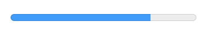

### HTML

1. 标签语义化

  * html,body,head,title 基本标签
  * p 段落
  * h1,h2,h3等  标题。 h1只能出现一次
  * ul ol li  有序和无序列表
  * em strong 强调和重点强调

  *<b> <i> <u>* 这些标签并没有语义化，是表象元素。

2. 高级文字排版
  * <blockquote cite="https://xxx.com"></blockquote> 标签用于引用原文，cite属性代表引用地址，是块元素。

  <q cite="https://xxx.com"></q> 标签用于引用原文，cite属性代表引用地址，是行内元素。

  <cite></cite> 标签用来放在引用旁边，常常是人或者书或者来源的名字。

  * <abbr title=""></abbr>  代表缩略词 title属性值是它的全称。 NASA 我伙呆 等。
  * <address></address> 是用来标记编写HTML文档的人的联系方式
  * <sup>是上标 <sub>是下标
  * <time datetime=""></time>用来表示时间， datetime属性是时间的格式化模板

3. 给HTML添加正确的区段标记表示（语义化结构）

  * header 标题栏。 如果是body子元素就是网站全局页眉，如果是字内容的子元素，就是字内容的页眉。
  * nav 导航栏。 页面主导航，不应包含二级链接。
  * main 主内容。 文档中最好只出现一次，并且不要嵌套进除body外的其他元素
  * aside 侧边栏，嵌套在main中。
  * footer 页脚
  * section 和 article 是main中的字内容。一般是section中包含几个 article。

4. figure标签

  figure标签是对重要内容添加的说明，说明性文字用 figcaption标签包裹

  ```
    <figure>
      
      <figcaption>对图片、音频、方程等内容的说明性文字</figcaption>
    </figure>
  ```

5. img图片和CSS中的background背景图使用区别：

    使用CSS中的background属性设置图片是为了装饰网页，提升视觉效果。

    而使用img元素插入图片是为了让内容有意义，图片也是内容的一部分。

6. video标签

    * src属性：资源地址
    * controls属性： 对视频的控制，暂停快进等
    * 标签内可以有段落文字存在，是在浏览器不支持video标签时显示的。
    * 不同的浏览器会兼容不同的视频格式，比如 FireFox 和 Chrome支持WebM格式，Internet Explorer 和 Safari 支持MP4

      同时针对此，video标签中可以嵌套source标签，来供可支持浏览器的选择。

      ```
        <video controls>
          <source src="rabbit320.mp4" type="video/mp4">
          <source src="rabbit320.webm" type="video/webm">
          <p>你的浏览器不支持 HTML5 视频。可点击<a href="rabbit320.mp4">此链接</a>观看</p>
        </video>
      ```

7. track标签可以给视频添加字幕，字幕文件为.vtt结尾的文件

    ```
    <video controls>
      <source src="example.mp4" type="video/mp4">
      <source src="example.webm" type="video/webm">
      <track kind="subtitles" src="subtitles_en.vtt" srclang="en">
    </video>
    ```

8. 响应式图片的内容在 *ResponsivePicture-HTML* 中
9. 表格的内容在 *Table-HTML* 中
10. 表单单行域类型有：
    * text
    * email
    * password
    * search
    * tel
    * url
11. 下拉内容方面， select标签中可以添加 optgroup标签给option项分组。

    select标签中 有一个 **multiple** 属性，可以定义为多选下拉框

12. 使用 *datalist* 标签可以给 *input* 增加自动补全功能，如下：

    ```
    <input type="text" name="myFruit" id="myFruit" list="mySuggestion">
    <datalist id="mySuggestion">
      <option>Apple</option>
      <option>Banana</option>
      <option>Blackberry</option>
      <option>Blueberry</option>
      <option>Lemon</option>
      <option>Lychee</option>
      <option>Peach</option>
      <option>Pear</option>
    </datalist>
    ```

13. 高级表单部件 ， *input* 的 *type*
    * number  只能输入数字，有 max, min, step 等属性约束其行为
    * range   滑块，有 max, min, step 等属性约束其行为
    * datetime-local   显示时间
    * month   显示月
    * time    显示时间
    * week    显示星期
    * color   拾色器
    * file    文件选择
    * hidden  隐藏元素，要设置name和value属性。
    * image

14. 进度条  
    
    `<progress max="100" value="75">75/100</progress>`

15. 表单发送文件 -- 使用 **enctype** 属性

    ```
    <form method="post" enctype="multipart/form-data">
    <div>
      <label for="file">Choose a file</label>
      <input type="file" id="file" name="myFile">
    </div>
    <div>
      <button>Send the file</button>
    </div>
    </form>
    ```
16. 常见的安全问题

  **XSS:** 跨站脚本，XSS允许攻击者将客户端脚本注入到其他用户查看的Web页面中。攻击者可以使用跨站点脚本攻击的漏洞来绕过诸如同源策略之类的访问控制。

  **CSRF:** CSRF攻击者试图将特权升级到特权用户(比如站点管理员)的权限，以执行他们不应该执行的操作

  **SQL注入:** 一种试图在目标web站点使用的数据库上执行操作的攻击类型

  **HTTP数据头注入和电子邮件注入:** 当您的应用程序基于表单上用户的数据输入构建HTTP头部或电子邮件时，就会出现这种类型的攻击

17. 表单验证两种方式：

  JavaScript校验，可以完全自定义校验方式。
  HTML5内置，性能更好，但是不能自定义。

18. HTML5内置属性校验

  HTML5的内置属性都会依赖两个CSS伪类： *:valid* *:invalid*  前者是输入正确的样式，后者相反。
  * **required** 属性。 放在 *input* 里面， 会检验value是否为空，为空会阻止表单提交。
  * **pattern** 属性。 值为 *正则表达式* 字符串，会与input元素中的value进行匹配
  * **minlength** 和 **maxlength**
  * 另外，想自定义错误提示的文字信息，可以用input元素的 **setCustomValidity()** 方法。

19. **role** 属性: 赋予标签意义，使无意义的标签具备可访问性。 几个属性值： *listbox* *presentation* *option* *tab* *menu*
20. **aria-selected** 属性: 赋予标签意义，标记当前选中元素。 值是true或false。
21. 使用 *AJAX* 发送表单数据：
    * 手动构建XMLHttpRequest，需要把数据转化成form表单格式  {test: 'ok'} -> 'test=ok'。
    * 使用XMLHttpRequest和FormData(表单对象) 发送表单数据, 发送时，请求头会自动设置。 `new FormData()`

22. FormData对象部分API
    * append(key, value) 为formData对象添加键值对
    * delete(key) 通过key 删除键值对
    * get(key) 通过key获得键值对
    * getAll(key) 获得所有key对应的值的数组
    * has(key) 查看是否有改键，返回true或false
    * set(key) 为key设置新值，如果没有则添加

### CSS
